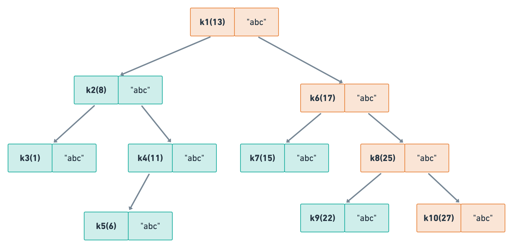
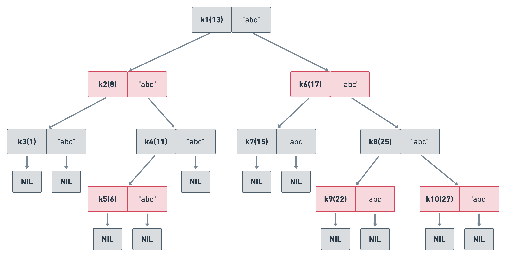
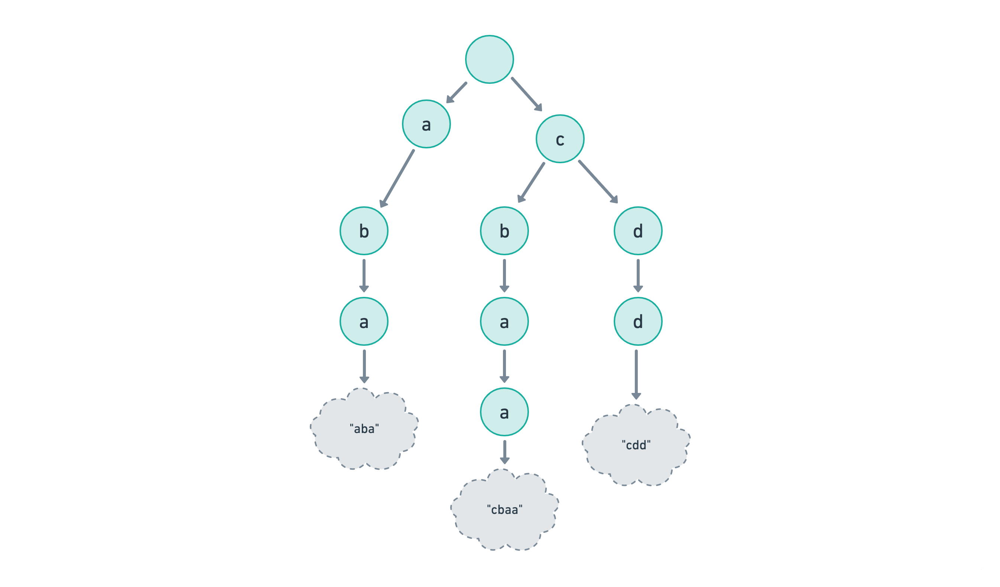
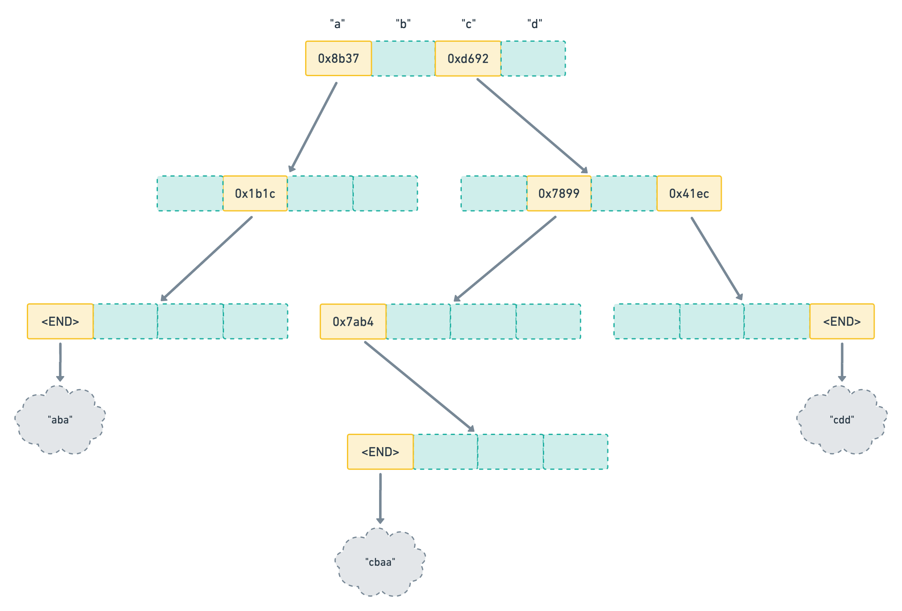
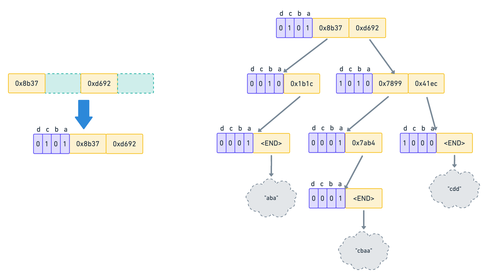
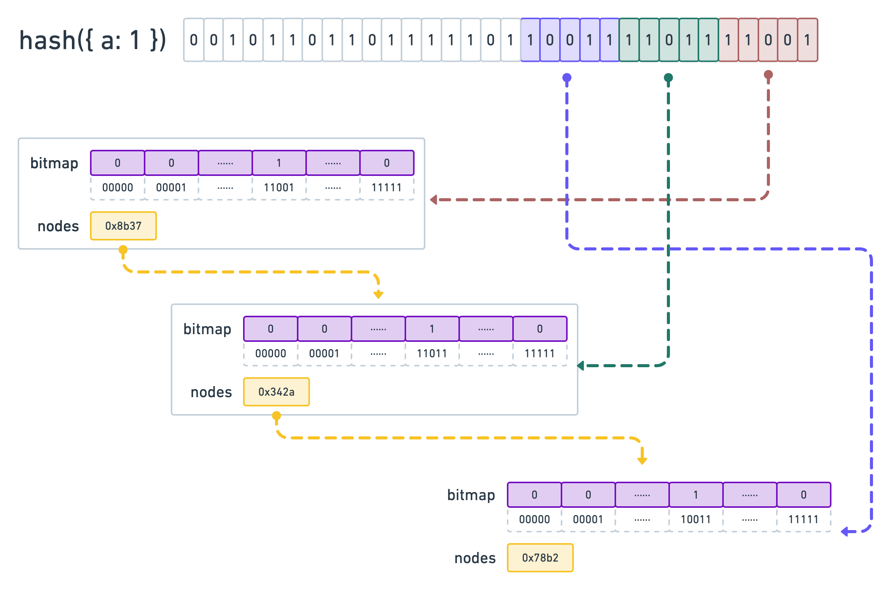
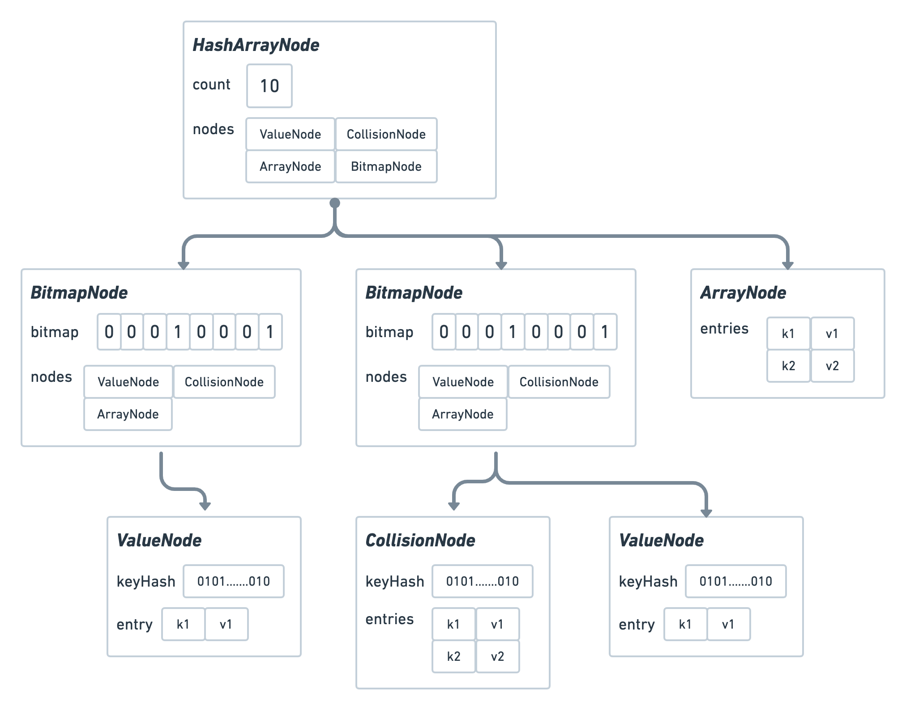

Persistent Data Structure（持久化数据结构）一旦创建，就无法通过增加、删除、更新操作修改现有数据，只会产生新的实例，比如：

```js
const { Map } = require('immutable');
const map1 = Map({ a: 1, b: 2, c: 3 });
const map2 = map1.set('b', 50);
map1.get('b'); // 2
map2.get('b'); // 50
```

`map1` 的内容不会因为更新操作而变化，永远保持最初创建时的内容——这就是持久化数据的不可变性（immutable）。数据的不可变性在开发过程的优势是：

- 为开发者提供了可预测性，无需担心数据经过某些逻辑之后发生「变异」；
- 在保持数据不可变性的基础上，更小的内存空间占用，比如同样对一个持久化的 Map 进行一千次更新操作，持久化数据结构通过结构共享的方式可以减少内存占用；
- 其他优势有待实践给出说明，此处不提；

<!-- more -->

## Map

> Immutability is good, and performance is necessary.

一个持久化的 Map 结构需要满足以下三点要求：

- 增删改查等操作的时间波动小趋向稳定，且时间只取决于 key 的数量；
- 高效的空间使用率，包括数据占用的空间和实现不可变性衍生的空间；
- key 可以是任意值，比如使用另一个 Map 作为 key；

本文所说的 Map 结构和 JavaScript ES6+ 中提供的 Map 基本相似，唯一不同点在于，本文所描述的 Map 为持久化数据结构，具有不可变性。持久化数据结构是 Clojure、Scale、Haskell 等编程语言的基础组成，相关开发者通过博客、会议等交流方式对外深度解析了背后的实现院里，本文即是对持久化数据结构的实现演进的一次学习。

## Solution

#### 方案一

使用数组、链表、串（链表的元素是固定长度的数组）实现，以数组为例：


偶数位存储 key，奇数位存储 value，模拟了对 Map 的存储，支持任意值作为 key，最大缺点是随机访问性差，时间复杂度为 O(n)。

#### 方案二

想要降低时间复杂度，可以尝试使用二叉搜索树实现：



在上图的二叉搜索树中，使用节点存储 kv 信息，同时对 k 计算一个摘要数字用于确定起在二叉树中的位置。如果是用一组排序好的数据构建二叉搜索树，就会如图中黄色节点所示，退化为链表，此时二叉搜索树最坏情况下时间复杂度为 O(n) 而不是 O($log_2 N$)。

将二叉搜索树演进为自平衡二叉树即可保证 O($log_2 N$) 的时间复杂度，比如红黑树：



红黑树是经典的持久化数据结构实现方案，具有良好的最坏时间复杂度 O($log_2 N$)、空间使用率（持久化版本需要 O($log_2 N$)），同时支持 key 为任意值。

> 但是，我们是否可以在 O($log_2 N$) 的时间复杂度上往 O(1) 更进一步？红黑树为了保持平衡在翻转、变色过程中比较节点的开销，是否可以避免？

#### 方案三

Trie Tree 又称前缀树或字典树，与二叉树不同，数据不直接存储在节点中，同一节点的子节点具有相同的前缀，根节点为空字符串：



上面是 Trie 树的概念模型，在真实的实现中更接近下图：



`aba` / `cbaa` / `cdd` 三个单词由 `a / b / c / d` 四个元素组成，可以构建一颗每个节点包含四个元素的 Tire 树。Trie 树最大的优势是时间复杂度为 O($log_m N$)，其中 m 为树的分支数，N 为可表示的最大数据量，但从图中也可以看出 Trie 树中存在大量空节点，容易成为稀疏矩阵。

解决 Trie 树成为稀疏矩阵的方案有很多，比如 Ternary Search Tree、Array Mapped Trie（AMT）。以 AMT 为例：



上图左侧演示的是如何压缩一个稀疏节点，右侧是 Trie 树转变为 AMT 之后的结构。对单个节点的压缩核心策略是使用一个 Bitmap 记录当前节点的使用情况，如果使用标记 1，未使用则标记 0，因此在遍历 AMT 树的时候需要额外做两件事（判定是否有值和值在哪）：


- 通过 `bitmap` 与 `offset("c")` 的与运算判断值是否存在；
- 通过 `bitmap` 与 `offset("c") - 1` 的与运算可以得到一个二进制，该二进制中 1 的个数（汉明重量）即为 `"c"` 的值的位置；

AMT 在时间复杂度上保持了 Trie 的 O($log_m N$)，同时降低了空间复杂度，目前唯一不能满足的是支持 key 为任意值。

#### HAMT

HAMT（Hash + AMT）在 AMT 的基础上，首要支持了 key 为任意值，核心策略是使用 hash 计算任意值的摘要信息并最终转换为二进制表示，以 5bit 为一组构建 AMT：



HAMT 并不是只使用 Bitmap 一种方式，组成 HAMT 的五种节点：



HAMT 的压缩机制：


## References

- [Immutable.js official website](https://immutable-js.github.io/immutable-js/)
- [Immutable Data Structure And JavaScript](https://jlongster.com/Using-Immutable-Data-Structures-in-JavaScript#Immutable.js)
- [A deep dive into Clojure's data structures](https://www.slideshare.net/mohitthatte/a-deep-dive-into-clojures-data-structures-euroclojure-2015)
- [A deep dive into Clojure's data structures - Vedio](https://www.youtube.com/watch?v=7BFF50BHPPo)
- [红黑树](https://zh.wikipedia.org/zh-hans/%E7%BA%A2%E9%BB%91%E6%A0%91)
- [Trie](https://zh.wikipedia.org/wiki/Trie)
- [ternary-search-tree javascript](https://github.com/mattpage/ternary-search-tree)
- [Ternary Search Tree - GeeksforGeeks](https://www.geeksforgeeks.org/ternary-search-tree/)
- [Ternary Search Tree Visualization](https://www.cs.usfca.edu/~galles/visualization/TST.html)
- [Understanding Clojure's Persistent Vectors](https://hypirion.com/musings/understanding-persistent-vector-pt-1)
- [JavaScript version of HAMT](https://github.com/mattbierner/hamt/blob/master/lib/hamt.js)
- [Introduction to HAMT](https://idea.popcount.org/2012-07-25-introduction-to-hamt/)
